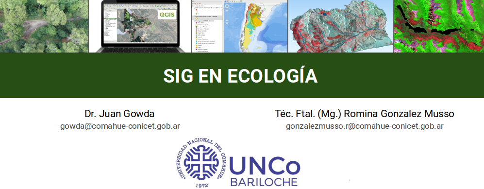

```{r setup, include=FALSE}
knitr::opts_chunk$set(echo = TRUE)
```

```{r, echo=FALSE, out.width="75%", fig.cap="", fig.align="center"}



```
------------------------------------------------------------------
### **CÓDIGOS GOOGLE EARTH ENGINE DE EJEMPLO**

#### **CON TUTORIAL GUÍA:**
- [Descarga de imagen Sentinel 2](https://github.com/romina-gonzalez-musso/Curso_SIG-Eco_2023/blob/main/mds/1_Descarga_Sentinel2.md)
- [Descarga de DEM](https://github.com/romina-gonzalez-musso/Curso_SIG-Eco_2023/blob/main/mds/2_Descarga_DEM.md)
- [Landsat 8 Composite](https://github.com/romina-gonzalez-musso/Curso_SIG-Eco_2023/blob/main/mds/3_Descarga_LANDSAT8_composite-pansharp.md)

#### **SOLO CÓDIGO:**
##### **PRODUCTOS A PARTIR DE ÁREAS (POLÍGONOS):**
- [OpenBuildings-v3](https://github.com/romina-gonzalez-musso/Curso_SIG-Eco_2023/blob/main/mds/Descarga_open_buildingsv3.js)

- [Landsat Surface Temperature](https://github.com/romina-gonzalez-musso/Curso_SIG-Eco/blob/main/mds/Landsat_SurfaceTemperature.js)

- [Descargar NDVI de composite L8](https://github.com/romina-gonzalez-musso/Curso_SIG-Eco/blob/main/mds/Composite_Landsat_con_NDVI.js)

- [Global Forest Change (Hansen et al. versión 2025)](https://github.com/romina-gonzalez-musso/Curso_SIG-Eco/blob/main/mds/Hansen_GlobalForestChange.js)

- [Composite de índices - LANDSAT 8 Y 9](https://github.com/romina-gonzalez-musso/Curso_SIG-Eco/blob/main/mds/Landsat89_Indices.js)

- [Composite de índices - SENTINEL 2](https://github.com/romina-gonzalez-musso/Curso_SIG-Eco/blob/main/mds/Sentinel2_Indices.js)


##### **SERIES A PARTIR DE PUNTOS (exporta tablas):**
- [NDVI Serie temporal para un sitio puntual con Landsat8](https://github.com/romina-gonzalez-musso/Curso_SIG-Eco/blob/main/mds/NDVI_Serie_temporal_Landsat8.js)

- [Extraer serie de datos NDVI de Landsat usando shapefile (asset)](https://github.com/romina-gonzalez-musso/Curso_SIG-Eco/blob/main/mds/Landsat_NDVI_desde_shape_puntos.js)

- [Landsat serie de temperatura a partir de puntos](https://github.com/romina-gonzalez-musso/Curso_SIG-Eco/blob/main/mds/Landsat_SurfaceTemperature_pointSeries.js)

##### **CLASIFICACIONES DE COBERTURA (ejemplos simples):**

- [Random Forest sencillo para 3 clases de cobertura](https://github.com/romina-gonzalez-musso/Curso_SIG-Eco/blob/main/mds/Clasificacion_RF.js)

#### **APPS INTERACTIVAS BASADAS EN GOOGLE EARTH ENGINE:**
- [Global Forest Change - GLAD Maryland](https://glad.earthengine.app/view/global-forest-change#bl=off;old=off;dl=1;lon=-41.50579389700618;lat=-39.51557340343385;zoom=3;)

- [Incendios forestales Patagonia](https://ee-gonzalezmusso-conicet.projects.earthengine.app/view/severidad-incendios-patagonia)
