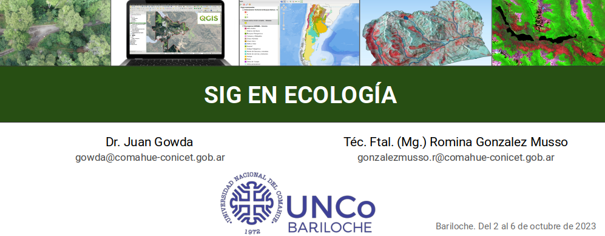

## 

### DATOS ESPACIALES DE EJEMPLO

Los datos vectoriales espaciales de este repositorio fueron tomados de
la IDE del [Instituto Geográfico Nacional
(IGN)](https://www.ign.gob.ar/NuestrasActividades/InformacionGeoespacial/CapasSIG).

- [Vectoriales]()
- [Proyecto_IGN_QGIS]()

La imagen KMZ fue producida a partir de una imagen Sentinel 2A:

- [Raster]()

### CÓDIGOS GEE DE EJEMPLO

- [Descarga de imagen Sentinel 2](..mds/1_Descarga_Sentinel2.md)
- [Descarga de DEM](https://posgrado.crub.uncoma.edu.ar/?page_id=13)
