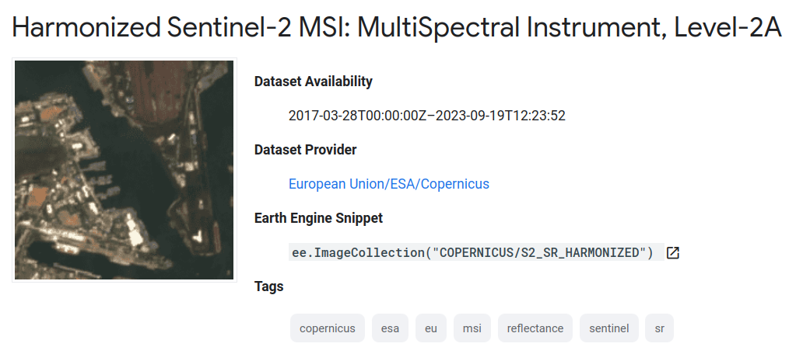
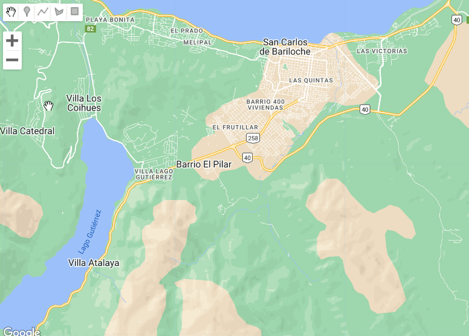
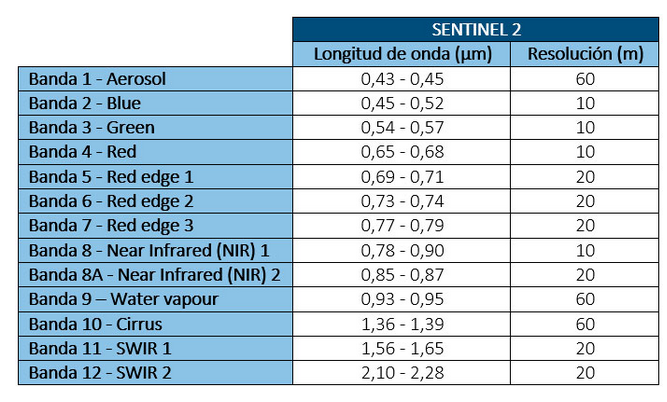
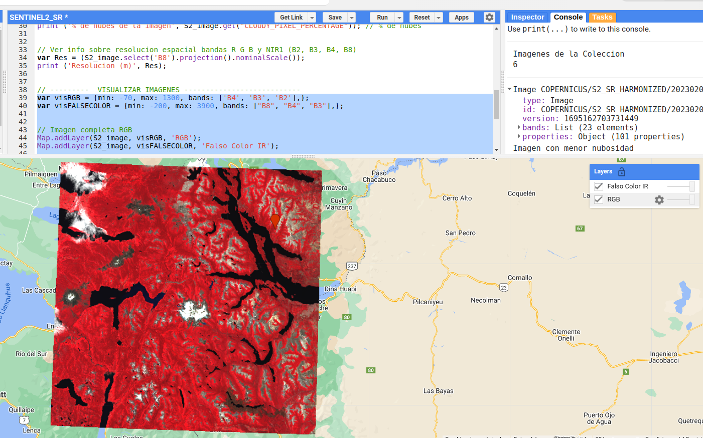
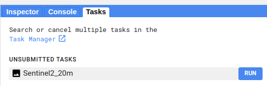

```{r setup, include=FALSE}
knitr::opts_chunk$set(echo = TRUE)
```

## **DESCARGA DE IMAGEN INDIVIDUAL SENTINEL-2**

En este primer ejercicio buscaremos y descargaremos una imagen Sentinel-2. Las características generales de este *asset* (bandas, resolución, nivel de procesamiento) se pueden explorar en el siguiente [link](https://developers.google.com/earth-engine/datasets/catalog/COPERNICUS_S2_SR_HARMONIZED)


```{r, echo=FALSE, out.width="70%", fig.cap="", fig.align="left"}



```

### **1. Definir un área de interés**
Definiremos un área de interés usando la herramienta de digitalización del Code Editor. Puede ser un punto o un polígono. Por defecto y si no lo cambiamos, cualquier elemento que digitalicemos llevará el nombre de `geometry`

```{r, echo=FALSE, out.width="65%", fig.cap="", fig.align="left"}



```


### **2. Definir fecha de interés y traer la colección**

```{javascript fechas}
// --------- DEFINIR FECHA ----------------------------------------
var date_start = '2023-01-01'
var date_end = '2023-02-28'

// --------- TRAER COLECCION DE IMAGENES ---------------------------
var S2_col = ee.ImageCollection('COPERNICUS/S2_SR_HARMONIZED')
                  .filterDate(date_start, date_end)
                  .filterBounds (geometry)
                  .filter(ee.Filter.lt('CLOUDY_PIXEL_PERCENTAGE',20))
                  

// Elegir la imagen de menor nubosidad de la coleccion
var S2_image = S2_col.sort("CLOUDY_PIXEL_PERCENTAGE").first()

```


### **3. Ver información de las imágenes**

En GEE, la solapa *consola* nos permite consultar y visualizar información sobre los productos. Para esto se usa la función `print()`

```{javascript metadata}
// Ver cantidad de imagenes en la coleccion
print('Imagenes de la Coleccion', S2_col.size());   

// Metadatos de la imagen de menor nubosidad
print(S2_image, 'Imagen con menor nubosidad')      

// Fecha de la imagen
print ('Fecha imagen seleccionada', ee.Date(S2_image.get('system:time_start')));  

// % de nubes
print ('% de nubes de la imagen', S2_image.get("CLOUDY_PIXEL_PERCENTAGE")); 

// Ver info sobre resolucion espacial bandas R G B y NIR1 (B2, B3, B4, B8)
var Res = (S2_image.select('B8').projection().nominalScale());
print ('Resolucion (m)', Res);


```

```{r, echo=FALSE, out.width="73%", fig.cap="", fig.align="left"}

knitr::include_graphics("figures_mds/Figura_S2_metadata.png")

```


### **4. Visualizar imagenes**

Los satélites capturan datos en distintas bandas del espectro electromagnético, cuyas combinaciones permiten resaltar distintos atributos de la cobertura terrestre. Las bandas pueden configurarse en los canales R-G-B (red-green-blue) para lograr combinaciones que resalten distintos atributos de interés, como ser vegetación, áreas urbanas, recursos hídricos, etc. Estas combinaciones producen  imágenes denominadas *Falso Color*. 

En esta práctica usaremos dos combinaciones:

- *Falso color infrarrojo*: buena sensibilidad para detectar y discriminar vegetación por la alta reflectividad en el infrarrojo. El canal R es reemplazado por la banda NIR, el G por la banda roja y el A por la verde. 

- *Color verdadero*: las bandas visibles para el ojo humano produciendo una imagen más similar al color natural. Se asigna la banda correspondiente a cada canal: R (rojo), G (verde) y B (azul)


La selección de bandas y el orden en que serán representadas dependen del sensor del satélite. En el caso de Sentinel-2, las bandas son las siguientes: 

```{r, echo=FALSE, out.width="55%", fig.cap="", fig.align="left"}



```

**Configurar los parámetros de visualizacion y mostrar las imágenes**

```{javascript visualizacion}
// Configurar parámetros de visualización
var visRGB = {min: -70, max: 1300, bands: ['B4', 'B3', 'B2'],};
var visFALSECOLOR = {min: -200, max: 3900, bands: ["B8", "B4", "B3"],};


// Agregar las imágenes
Map.addLayer(S2_image, visRGB, 'RGB');
Map.addLayer(S2_image, visFALSECOLOR, 'Falso Color IR');

Map.centerObject(geometry, 9);

```

```{r, echo=FALSE, out.width="73%", fig.cap="", fig.align="left"}



```


### **5. Descargar imagen**

En GEE la descarga de los productos o imágenes que generamos se hace a través de Google Drive. El primer paso es generar el *task* para exportar el objeto de interés. 

```{javascript descarga}
// ---------  DESCARGAR IMAGEN---------------------------
Export.image.toDrive({
  image: S2_image.select("B8", "B4", "B3", "B2"),
  description: 'Sentinel2_20m',  // Nombre del archivo
  scale: 20,
  crs: 'EPSG:4326', 
  folder: 'GEE_export'});  // Nombre de la carpeta en Google Drive

```

En la solapa *Tasks* aparece la opción para iniciar la exportación a Google Drive. Simplemente hay que hacer click en *Run*. El tiempo de espera dependerá del tamaño del producto a exportar.  

```{r, echo=FALSE, out.width="55%", fig.cap="", fig.align="left"}



```