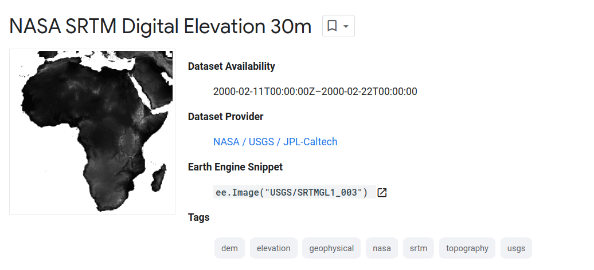
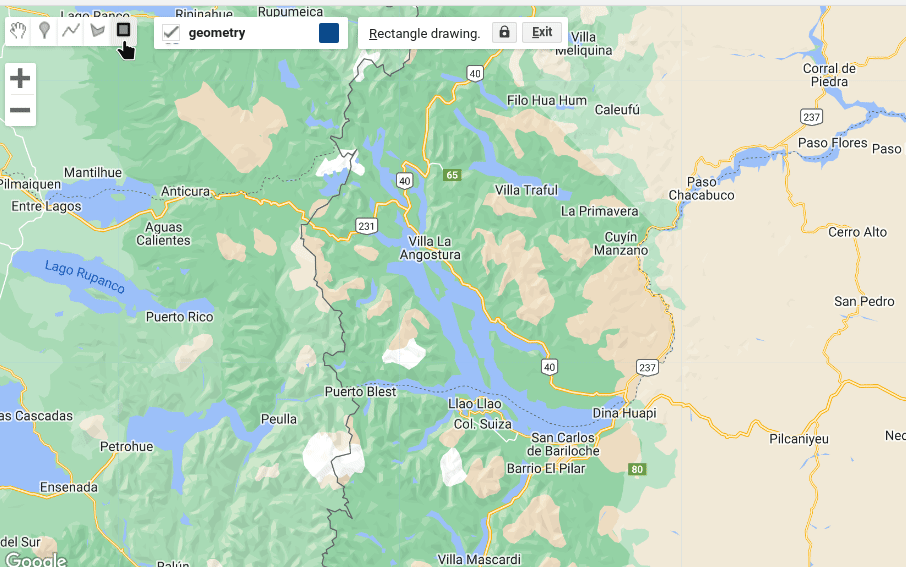
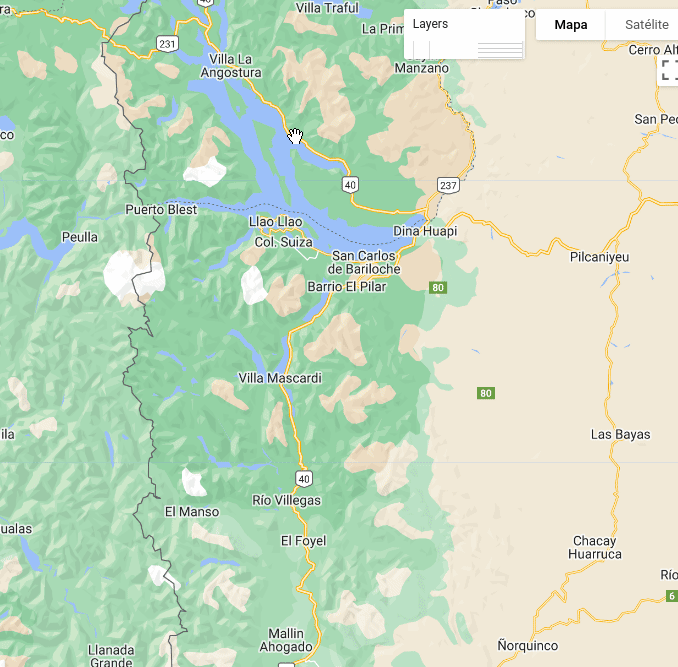

## **DESCARGA DE IMAGEN DEM SRTM NASA (30m)**

Buscaremos el Modelo Digital de Elevación (DEM) generado a partir de la
misión SRTM y producido por NASA. Las características generales de este
*asset* se pueden explorar en el siguiente
[link](https://developers.google.com/earth-engine/datasets/catalog/USGS_SRTMGL1_003)



### **1. Definir un área de interés**

Definiremos un área de interés usando la herramienta de digitalización
del Code Editor. En este caso definiremos un polígono que usaremos luego
para recortar el DEM. Por defecto y si no lo cambiamos, cualquier
elemento que digitalicemos llevará el nombre de `geometry`



### **2.Traer el asset del DEM**

``` js
// --------- TRAER EL ASSET ---------------------------
var DEM = ee.Image('USGS/SRTMGL1_003');

var DEM_clip = DEM.clip(geometry) // cortar al área de estudio
```

<script>
// --------- TRAER EL ASSET ---------------------------
var DEM = ee.Image('USGS/SRTMGL1_003');
&#10;var DEM_clip = DEM.clip(geometry) // cortar al área de estudio
&#10;</script>

### **3. Ver información de las imágenes**

En GEE, la solapa *consola* nos permite consultar y visualizar
información sobre los productos. Para esto se usa la función `print()`

``` javascript
// --------- VER METADATOS ---------------------------
print(DEM, 'DEM INFO GENERAL')

var Res = (DEM.select('elevation').projection().nominalScale());
print ('Resolucion (m)', Res);

print('Bandas del DEM', DEM.bandNames())
```

### **4. Operaciones básicas con DEM**

En líneas generales, los modelos digitales de elevación constituyen una
representación continua del relieve y la topografía del terreno. Cada
píxel corresponde a la altitud en metros a una resolución determinada. A
partir de esta información, es posible derivar otros atributos de
terreno como puede ser la pendiente y la exposición. En GEE, como en
cualquier software GIS, se pueden calcular estos productos.

**Método 1: pendiente con función `ee.Terrain.slope()`**

``` javascript
// --------- CALCULAR LA PENDIENTE ---------------------------
var elevacion = DEM_clip.select('elevation'); // En grados de 0 a 90
var pendiente = ee.Terrain.slope(elevacion);
```

**Método 2: productos topográficos con `ee.Terrain.products()`**

La función
[`ee.Terrain.products`](https://developers.google.com/earth-engine/apidocs/ee-terrain-products)
usa como input un DEM y produce una nueva imagen que además de contener
la altitud (m) agrega 3 nuevas bandas: pendiente (º) y exposición (º) y
un mapa de sombras.

``` javascript
// --------- USAR LA FUNCION ee.Terrain.products ---------------------------
var terrain = ee.Terrain.products(DEM_clip);

print('Bandas de la funcion ee.Terrain.products', terrain.bandNames());
```


### **5. Visualizar**

``` javascript
// --------- VISUALIZAR EN EL MAPA ---------------------------
var visDEM = {min: 550, max: 2700,
  palette: ['0602ff', '235cb1', '307ef3', '269db1', '30c8e2', '32d3ef', '3ae237',
  'b5e22e', 'd6e21f', 'fff705', 'ffd611', 'ffb613', 'ff8b13', 'ff6e08',
  'ff500d', 'ff0000', 'de0101', 'c21301']}


Map.centerObject(geometry, 8.5)

// Altidud en gris y en paleta de colores
Map.addLayer(DEM_clip, {min: 600, max: 2500}, 'Altitud (m)');
Map.addLayer(DEM_clip, visDEM, 'Altitud (m) en color');

// Ver la pendiente 
Map.addLayer(pendiente, {min: 0, max: 60}, 'Pendiente (º)');

// Hillshade de la funcion Terrain Products
Map.addLayer(terrain.select('hillshade'), {min: 0, max: 255}, 'Hillshade');
```



### **6. Descargar**

``` javascript
// --------- DESCARGAR ---------------------------------------
Export.image.toDrive({
  image: DEM_clip.select("elevation"),
  description: 'DEM_SRTM_30m',
  scale: 30,
  crs: 'EPSG:22181',
  folder: 'GEE_export',
  region: geometry});
```
