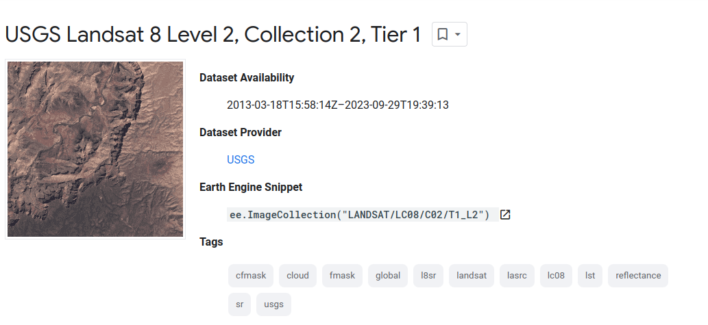
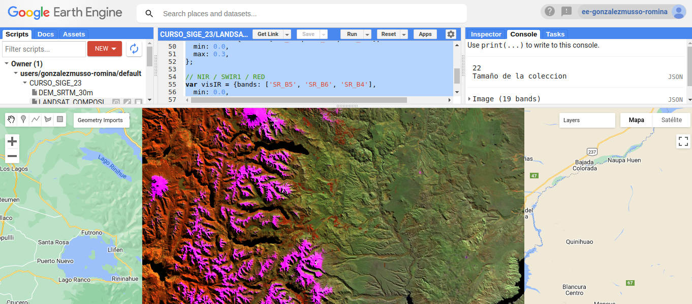

```{r setup, include=FALSE}
knitr::opts_chunk$set(echo = TRUE)
```

## **CREACIÓN Y DESCARGA DE UN COMPUESTO LANDSAT 8**

Crearemos un compuesto de imágenes usando Landsat 8 Surface Reflectance. Las características generales de este *asset* se pueden explorar en el siguiente [link](https://developers.google.com/earth-engine/datasets/catalog/LANDSAT_LC08_C02_T1_L2)


```{r, echo=FALSE, out.width="80%", fig.cap="", fig.align="left"}



```

### **1. Definir un área de interés**
Definiremos un área de interés usando la herramienta de digitalización del Code Editor. En este caso definiremos un polígono que se corresponda al área de interés. Por defecto y si no lo cambiamos, cualquier elemento que digitalicemos llevará el nombre de `geometry`

```{r, echo=FALSE, out.width="65%", fig.cap="", fig.align="left"}

knitr::include_graphics("figures_mds/Figura_DEM_gif.gif")

```


### **2. Definir el rango de fechas**

```{javascript fecha, message=FALSE, warning=FALSE, paged.print=FALSE, results = FALSE}
// --------- DEFINIR FECHA ----------------------------------------
var inicio = '2023-04-01'
var final = '2023-08-30'

```


### **3. Traer la Colección de Imágenes**
```{javascript asset, message=FALSE, warning=FALSE, paged.print=FALSE, results = FALSE}
// --------- TRAER COLECCION DE IMAGENES --------------------
var L8_Col= ee.ImageCollection("LANDSAT/LC08/C02/T1_L2") 
  .filterDate (inicio, final) 
  .filterBounds (geometry) 
  .filterMetadata ('CLOUD_COVER', 'Less_Than', 20);
```

### **4. Aplicar factores de escalado y el filtro por nubes**

```{javascript filtros, message=FALSE, warning=FALSE, paged.print=FALSE, results = FALSE}
// Aplicar los factores de escalado 
function applyScaleFactors(image) {
  var opticalBands = image.select('SR_B.').multiply(0.0000275).add(-0.2);
  var thermalBands = image.select('ST_B.*').multiply(0.00341802).add(149.0);
  return image.addBands(opticalBands, null, true)
              .addBands(thermalBands, null, true);
}

var L8_Col = L8_Col.map(applyScaleFactors);


// Aplicar el filtro de nubes
function maskL8(image){
  var qaMask = image.select('QA_PIXEL').bitwiseAnd(parseInt('11111', 2)).eq(0);
  var saturationMask = image.select('QA_RADSAT').eq(0);
  return image.updateMask(qaMask).updateMask(saturationMask);
}

var L8_Col = L8_Col.map(maskL8);
```

Nota: el filtro de nubes se hace usando las bandas de calidad de Landsat 8. Más información en [el sitio oficial de USGS](https://www.usgs.gov/landsat-missions/landsat-collection-2-quality-assessment-bands) y del operador [bitwiseAnd](https://spatialthoughts.com/2021/08/19/qa-bands-bitmasks-gee/)

### **5. Calcular el compuesto**
Se utiliza un operador estadístico de reducción para crear el compuesto y luego recortarlo al área de estudio. En este caso se utiliza `median()`. 

```{javascript compuesto, message=FALSE, warning=FALSE, paged.print=FALSE, results = FALSE}
// Crear el compuesto
var L8_comp = L8_Col.median().clip(geometry)

```

### **6. Ver información de las imágenes**
```{javascript metadata, message=FALSE, warning=FALSE, paged.print=FALSE, results = FALSE}
// ---------  VER INFORMACION DE LAS IMAGENES ------------------
print (L8_Col.size(), 'Tamaño de la coleccion');

print(L8_comp, 'Metadata del compuesto resultante')

```

### **7. Visualizar**
```{javascript vis, message=FALSE, warning=FALSE, paged.print=FALSE, results = FALSE}
// ---------  VISUALIZAR ------------------
var visRGB = {bands: ['SR_B4', 'SR_B3', 'SR_B2'], 
  min: 0.0,
  max: 0.3,
};

// NIR / SWIR1 / RED
var visIR = {bands: ['SR_B5', 'SR_B6', 'SR_B4'], 
  min: 0.0,
  max: 0.4,
};

Map.centerObject(geometry, 9)

Map.addLayer(L8_comp, visRGB, 'True Color');
Map.addLayer(L8_comp, visIR, 'False Color');

```

```{r, echo=FALSE, out.width="85%", fig.cap="", fig.align="left"}



```


### **8. Descargar**


```{javascript task, message=FALSE, warning=FALSE, paged.print=FALSE, results = FALSE}
// --------- DESCARGAR ---------------------------------------
Export.image.toDrive({
  image: L8_comp,
  description: 'L8_30m_composite',
  scale: 30,
  crs: 'EPSG:22181',
  folder: 'GEE_export',
  region: geometry});

```


